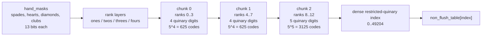

# Lookup-Based 7-Card Hand Evaluator

## Mental model

The evaluator splits 7-card evaluation into two paths:
1. flush/straight-flush via direct mask lookup
2. non-flush via canonical rank-multiplicity encoding and hash-table lookup

No 21-subset runtime search is performed.

---

## Card layout assumption

```
bit = suit * 13 + rank

bits  0–12  spades   (2♠=0 .. A♠=12)
bits 13–25  hearts   (2♥=13 .. A♥=25)
bits 26–38  diamonds (2♦=26 .. A♦=38)
bits 39–51  clubs    (2♣=39 .. A♣=51)
```

---

## Evaluator structure

```cpp
hand_rank evaluate(card_mask seven) noexcept {
    const hand_masks masks = suit_rank_masks(seven);

    suit flush = suit::spades;
    if (find_flush_suit(masks, flush))
        return flush_table[flush_index(masks, flush)];

    const std::size_t index = non_flush_quinary_index(masks);
    return non_flush_table[index];
}
```

The same four suit-rank masks are reused for both flush detection and non-flush
key generation.

---

## Flush path

### Detection

Each field in `hand_masks` is a 13-bit rank mask per suit (`spades`, `hearts`,
`diamonds`, `clubs`). `popcount(mask) >= 5`
detects a flush suit.

### Encoding

`flush_index` is that suit's 13-bit rank mask.

### Table

```cpp
hand_rank flush_table[1 << 13];  // 8192 entries
```

Index is the 13-bit rank presence mask for the flush suit. Value is the best
5-card flush/straight-flush rank for that mask.

---

## Non-flush path

### Canonical multiplicity encoding

A 7-card rank multiset is encoded with four 13-bit layers:

```
ones    ranks appearing >= 1
twos    ranks appearing >= 2
threes  ranks appearing >= 3
fours   ranks appearing >= 4
```

From `hand_masks`:

```cpp
const uint16_t s0 = masks.spades;
const uint16_t s1 = masks.hearts;
const uint16_t s2 = masks.diamonds;
const uint16_t s3 = masks.clubs;

const uint16_t pair01_single = s0 ^ s1;
const uint16_t pair23_single = s2 ^ s3;
const uint16_t pair01_double = s0 & s1;
const uint16_t pair23_double = s2 & s3;

const uint16_t split_pairs = pair01_single & pair23_single;
const uint16_t fours   = pair01_double & pair23_double;
const uint16_t twos    = pair01_double | pair23_double | split_pairs;
const uint16_t threes  = (pair01_double & pair23_single)
                       | (pair23_double & pair01_single)
                       | fours;
const uint16_t ones    = pair01_single | pair23_single | twos;
```

This is a carry-save-style threshold network over the four suit bitboards. It
produces the same `>= 1`, `>= 2`, `>= 3`, and `>= 4` rank layers as the direct
pairwise/triple/quad expressions, but with fewer wide Boolean terms in the
runtime path.

Pack to a canonical key:

```cpp
const uint64_t key =
      uint64_t(ones)
    | (uint64_t(twos)   << 13)
    | (uint64_t(threes) << 26)
    | (uint64_t(fours)  << 39);
```

Key bit layout:

```text
63                                                          52 51        39 38        26 25        13 12         0
+------------------------------------------------------------+------------+------------+------------+------------+
| unused                                                     | fours      | threes     | twos       | ones       |
+------------------------------------------------------------+------------+------------+------------+------------+
                                                             13 bits      13 bits      13 bits      13 bits
```

### Restricted quinary index

The four layers are converted to one base-5 digit per rank:

```cpp
count(rank) =
      bit(ones, rank)
    + bit(twos, rank)
    + bit(threes, rank)
    + bit(fours, rank);
```

The 13 quinary digits are restricted to valid 7-card rank multisets, so their
sum is exactly 7 and each digit is in `[0, 4]`. A dynamic-programming table maps
each valid quinary pattern to a dense index in `[0, 49204]`.

```cpp
index += quinary_dp[count][remaining_ranks][remaining_cards];
remaining_cards -= count;
```

The runtime indexer chunks the 13 ranks into `4 + 4 + 5` ranks and uses generated
chunk tables, avoiding a 13-step dependent DP loop in the hot path. The rank
table is therefore a dense array, with no hash, stored key, empty slots, or
probe loop.

Within each chunk, the runtime path maps the four layer masks to a quinary chunk
code with small precomputed pair-weight tables. `ones/twos` and `threes/fours`
are each combined as one table lookup, replacing four separate weight lookups
with two pair lookups plus one addition per chunk.



Packed chunk-entry layout:

```text
31                       24 23                                                    0
+-------------------------+--------------------------------------------------------+
| cards used by this chunk | dense-index contribution                              |
+-------------------------+--------------------------------------------------------+
         8 bits                                      24 bits
```

The low 24 bits are selected with `0x00ff'ffff`; the high byte is read with
`packed >> 24`.

### Numeric layout notes

Several small integers appear directly in the hot-path code. They are deliberately
left as literals, while the layout is documented here:

| Value | Meaning |
|---:|---|
| `7` | Cards in the evaluated Hold'em hand; valid remaining-card counts are `0..7`. |
| `13` | Ranks in the deck; each suit-rank mask is 13 bits. |
| `12` | Highest rank index, used to convert a rank offset to the DP remaining-ranks dimension. |
| `4` | Suits, maximum same-rank multiplicity, and the first two chunk widths. |
| `5` | Quinary radix for rank counts `0..4`; also the final chunk width. |
| `625` | `5^4`, the number of possible codes for a 4-rank chunk. |
| `3125` | `5^5`, the number of possible codes for a 5-rank chunk. |
| `2` | Pair width used by the carry-save layer builder and pair-weight tables. |
| `256` | Pair-weight table entries for two 4-bit layer fields. |
| `1024` | Pair-weight table entries for two 5-bit layer fields. |
| `24` | Low-bit width of the packed chunk index contribution. The high byte stores cards used. |
| `0x0f` | Mask for a 4-rank field. |
| `0x1f` | Mask for a 5-rank field. |

### Generator-time consistency check

During `rank_table` generation, entries are sorted by key and checked for
duplicate keys with conflicting ranks. A conflict aborts generation, enforcing
that the canonical key maps to exactly one non-flush hand rank.

For stronger validation from real card inputs, the generator also supports:

```bash
zeta-gen-holdem-tables --validate-canonical
```

This exhaustively enumerates all non-flush 7-card hands, recomputes the key
from both rank counts and suit masks, and checks:

- `key_from_counts == key_from_suits`
- key exists in the generated dense quinary table
- repeated observations of the same key never disagree on rank

### Dense-table statistics

The generator computes table diagnostics and emits them in
`tables.generated.cpp` comments:

- non-flush entries
- quinary slots
- filled quinary slots
- indexing scheme

---

## Tables summary

| Table | Size | Index |
|---|---|---|
| `flush_table` | 8192 entries | 13-bit suit rank mask |
| `non_flush_table` | 49205 entries | restricted quinary rank-count index |
| `quinary_chunk*` | 35000 packed entries | chunked restricted-quinary index contribution |

---

## Source layout

```
zeta/holdem/src/
├── eval.h
├── evaluator.h
├── tables.h
├── tables.cpp
└── tables.generated.cpp

zeta/tools/holdem/src/
└── gen_tables.cpp
```

---

## Runtime profile

| Step | Cost |
|---|---|
| Build `s0..s3` suit-rank masks | 4× `suit_ranks` |
| Flush check | 4× popcount on 13-bit masks |
| Flush path | single table load |
| Non-flush key build | bitwise AND/OR + shifts |
| Non-flush lookup | restricted quinary index + dense table load |
