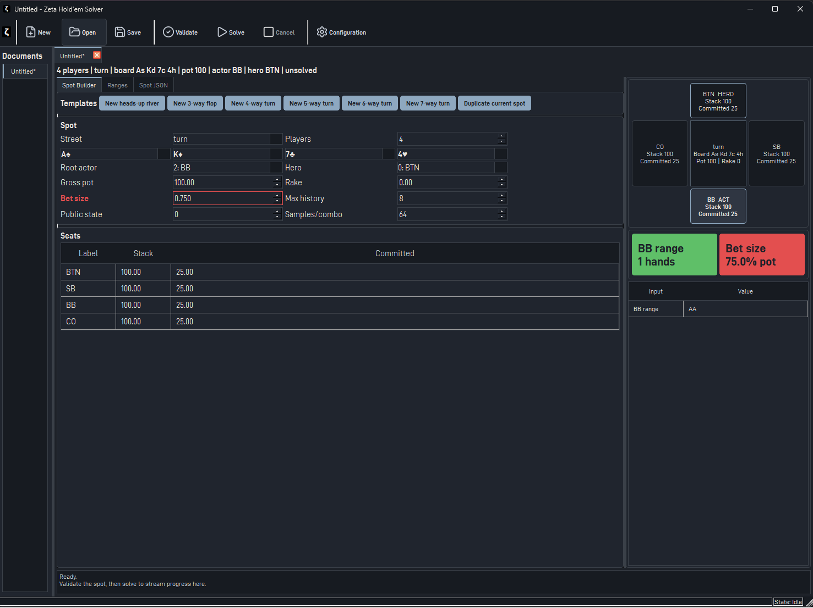

# Hold'em Solver UI User Guide

This guide explains how to use `zeta-ui-holdem`, the Qt desktop interface for creating Texas Hold'em solver spots, running CFR+ solves, and inspecting strategy output.



> [!NOTE]
> The UI uses the same spot, range, validation, and solver surfaces as the `zeta-solve` CLI. See the [zeta-solve CLI guide](../cli_usage.md) for the JSON schema and command-line workflow.

## Getting Started

### Build and launch

Build the UI target from a configured CMake build tree:

```sh
cmake --build build --config Release --target zeta-ui-holdem
```

Run the executable from the build output directory. On Windows builds from the default `build` directory:

```powershell
.\build\zeta\ui\holdem\Release\zeta-ui-holdem.exe
```

Debug builds use:

```powershell
.\build\zeta\ui\holdem\Debug\zeta-ui-holdem.exe
```

### First solve

1. Click **New** to create a spot document.
2. In **Spot Builder**, choose a template such as **New heads-up river** or **New 3-way flop**.
3. Fill every visible board card. The selected street determines the required count: flop = 3, turn = 4, river = 5.
4. Check **Players**, **Root actor**, **Hero**, pot, rake, bet size, and the seats table.
5. Open **Ranges** and enter or select each player's range.
6. Click **Validate**. Fix any inline or dialog errors.
7. Click **Configuration** if you want to change iterations or worker threads.
8. Click **Solve**.
9. When the solve completes, the **Ranges** tab is replaced by **Strategy Explorer**.
10. Click **Save** or **Save As...** to persist the spot, solve artifact, action tree, metadata, and history in a UI document JSON file.

> [!TIP]
> Start with a low iteration count for UI checks, then increase iterations for real analysis after the spot validates and the ranges look right.

## UI Layout

### Command bar

The top command bar contains:

| Button | Purpose |
|---|---|
| **New** | Creates a new unsaved spot document. |
| **Open** | Opens a plain spot JSON file or a saved UI document JSON file. |
| **Save** | Saves the active document. If no path exists, it prompts for a path. |
| **Validate** | Parses the active **Spot JSON** and validates the structured spot. |
| **Solve** | Starts CFR+ for the active validated spot. |
| **Cancel** | Requests cancellation. Cancellation is only effective before solver work has started. |
| **Configuration** | Opens UI and solver settings. |

Only one solve can run at a time. While a solve is running, the active document's JSON editor is read-only and the status bar reports progress state.

### Document rail and tabs

The left rail lists open documents. Each document also has a tab. An asterisk marks unsaved changes. Closing a dirty document prompts to save, discard, or cancel.

### Main workspace

Each document workspace has:

| Area | Purpose |
|---|---|
| **Spot Builder** | Structured controls for street, board, players, stacks, commitments, pot, rake, actor, hero, and solver spot parameters. |
| **Ranges** | Range text editor, 13x13 hand-class matrix, combo analysis, blockers, import/export, and range shortcuts. Available before a solve. |
| **Strategy Explorer** | Action tree, aggregate strategy, hand-class strategy matrix, combo details, EVs, and strategy filtering. Available after a solve. |
| **Spot JSON** | Raw JSON representation of the current spot. |
| **Inspector panel** | Table-state preview, editable input summary before solving, and spot context. |
| **Solve console** | Run start details, timing, completion status, or failure messages. |

## Creating and Editing Spots

### Templates

The **Spot Builder** provides templates for common starting points:

| Template | Street | Players | Default board |
|---|---|---:|---|
| **New heads-up river** | river | 2 | `As Kd 7c 4h 2s` |
| **New 3-way flop** | flop | 3 | `As Kd 7c` |
| **New 4-way turn** | turn | 4 | `As Kd 7c 4h` |
| **New 5-way turn** | turn | 5 | `As Kd 7c 4h` |
| **New 6-way turn** | turn | 6 | `As Kd 7c 4h` |
| **New 7-way turn** | turn | 7 | `As Kd 7c 4h` |

**Duplicate current spot** creates a new document tab with the active spot copied into it. This is useful for comparing board, sizing, or range changes without overwriting the original.

### Spot fields

| Field | Meaning |
|---|---|
| **Street** | `flop`, `turn`, or `river`; controls how many board-card selectors are visible. |
| **Board cards** | Public board cards. Cards must be valid and unique. |
| **Players** | Number of seats, from 2 to 7. Resizing also resizes ranges, stacks, and commitments. |
| **Root actor** | Seat that acts at the root of the solve tree. |
| **Hero** | Seat used for hero-centered artifact metadata and EV display. |
| **Gross pot** | Total pot before rake. Must be positive. |
| **Rake** | Rake removed from the pot. Must be between zero and gross pot. |
| **Bet size** | Pot fraction used for generated bet actions. `0.750` means 75% pot. |
| **Max history** | Betting-history cap used when building the game tree. |
| **Public state** | User-defined public-state identifier stored with the spot. |
| **Samples/combo** | Sampling budget for multiplayer/pre-river terminal estimation. Higher values reduce variance and increase runtime. |
| **Seats table** | Per-seat label, stack, and committed amount. Labels cannot be empty; stack and committed values cannot be negative. |

> [!WARNING]
> A spot must have a street-consistent board and at least one live combo in every range. Board blockers can make an otherwise valid-looking range empty.

### Spot JSON tab

The **Spot JSON** tab is the canonical serialized spot. Structured edits from **Spot Builder** and **Ranges** rewrite this JSON automatically.

You can edit JSON directly, then click **Validate** or **Solve**. Direct JSON edits must follow the same schema as the CLI spot format. If parsing or validation fails, the document is not replaced.

## Editing Ranges

The **Ranges** tab edits one seat at a time. Use the seat selector beside the **Range** title to choose the active player.

### Range text

Range text uses the PokerStove-style parser documented in [PokerStove-compatible range parser](../range_parser.md). Common forms include:

| Form | Example | Meaning |
|---|---|---|
| Pair class | `AA` | All ace-pair combos not blocked by the board. |
| Suited class | `AKs` | Suited ace-king combos. |
| Offsuit class | `AQo` | Offsuit ace-queen combos. |
| Exact combo | `AsKs` | One exact two-card combo. |
| Weighted combo/class | `AsKs:0.5`, `AA:0.25` | Fractional range weight. |
| Comma list | `AA,AKs,AQo` | Union of multiple selectors. |

The range panel shows:

| Display | Meaning |
|---|---|
| **combos** | Combos selected before blockers. |
| **live** | Combos that remain after board blockers. |
| **% of all hands** | Approximate preflop coverage. |
| **Blocked** | Board cards that block selected combos. |

### Matrix editing

The 13x13 matrix is both an editor and visualization:

1. Click a hand class to toggle it on or off.
2. Click and drag across cells to apply the same enabled/disabled state.
3. Selected cells show live-combo count and total class-combo count.
4. Heat coloring indicates how much of a selected class remains live.
5. A selected class with zero live combos is shown as blocked.

### Range shortcuts

| Button | Action |
|---|---|
| **Pairs** | Adds all pocket-pair classes. |
| **Suited** | Adds suited non-pair classes. |
| **Offsuit** | Adds offsuit non-pair classes. |
| **Broadways** | Adds broadway classes. |
| **Clear** | Clears the active seat's range. |
| **Copy** | Copies the active range text to the clipboard. |
| **Paste** | Replaces the active range text from the clipboard. |
| **Normalize** | Rewrites a valid range into normalized exact combo text. |
| **Import** | Loads range text from a `.txt` file. |
| **Export** | Saves the active range text to a `.txt` file. |

> [!TIP]
> Use **Normalize** before sharing a spot when you want exact, explicit combo weights rather than compact class syntax.

## Validating a Spot

Click **Validate** before solving. Validation checks:

1. Street is `flop`, `turn`, or `river`.
2. Board card count matches the street.
3. Board cards are valid and unique.
4. Player count is between 2 and 7.
5. Ranges, stacks, and contributions match player count.
6. Root actor and hero refer to existing seats.
7. Gross pot is positive.
8. Rake is not negative and does not exceed the gross pot.
9. Bet fraction and samples/combo are positive.
10. Seat labels are non-empty.
11. Stacks and commitments are non-negative.
12. Every seat range parses and has at least one live combo after blockers.

Inline errors appear near the affected **Spot Builder** section. Range parse errors appear in the **Ranges** tab with the parser position and message.

## Solver Configuration

Open **Configuration** from the command bar.

### UI settings

| Setting | Options |
|---|---|
| **Theme** | Dark Pro, Light Pro, High Contrast. |
| **Density** | Comfortable or Compact. |

### Solver settings

| Setting | Meaning |
|---|---|
| **Iterations** | CFR+ iterations for the next solve. |
| **Progress batch iterations** | Number of CFR iterations between progress updates. |
| **Worker threads** | CFR worker thread count, capped by available hardware threads and the UI maximum. |

Settings persist between sessions, along with recent files, pinned files, window splitters, and workspace splitters.

## Running a Solve

When you click **Solve**, the UI:

1. Parses the active **Spot JSON**.
2. Runs the same structured validation used by **Validate**.
3. Starts a solver session with the current iteration and runtime settings.
4. Writes run metadata to the solve console.
5. Executes CFR+ asynchronously.
6. Stores the artifact and action-tree solution in the document when complete.
7. Adds a solve-history entry with timestamp, iteration count, and outcome.
8. Refreshes the document so **Strategy Explorer** becomes available.

The solve console reports graph-build time, CFR iteration time, extraction time, finish timestamp, and final status.

> [!WARNING]
> **Cancel** only prevents a solve that has not started solver work yet. It is not an interrupt for a solve already inside CFR work.

## Exploring Strategy

After a completed solve, open **Strategy Explorer**.

### Action Tree

The **Action Tree** panel shows the root and generated child nodes:

| Column | Meaning |
|---|---|
| **Node** | Root or the action that led to the child node. |
| **Actor** | Acting seat at that node, or terminal marker. |
| **Actions** | Number of legal actions at that node. |

Selecting a node updates the breadcrumb, node table state, node action-frequency table, strategy matrix, and hand table. Combo-level strategy is shown for the root node; child nodes without combo strategy show "No node strategy".

### Artifact summary

The **Artifact** panel shows:

| Item | Meaning |
|---|---|
| Algorithm and iterations | Solver metadata, normally CFR+ and the configured iteration count. |
| Timestamp and git revision | Runtime provenance. |
| Players, hero, actor, street, board | Spot identity for the solved artifact. |
| Ranges | Seat ranges used by the solve. |
| Action cards | Aggregate action frequencies and average EV. |
| Average EV and Mix | Overall EV and strategy mixing indicator. |

### Strategy matrix and filters

The strategy matrix displays each hand class with action mix and EV when combo strategy is available. Use the **Strategy** filter to focus the matrix and tables on action categories, such as all hands, fold-heavy hands, check/call hands, or bet/raise hands.

Clicking a hand class updates **Hand Detail**. Clicking a row in the lower hand table also selects its class.

### Hand Detail and hand table

| Table | Purpose |
|---|---|
| **Hand Detail** | Exact combos in the selected hand class, action frequencies, EV, range weight, and blockers. |
| **Hand table** | All filtered strategy rows with hand, best action, action frequencies, EV, and range weight. The table is sortable. |

EV values are shown with signs for positive and negative values. Frequencies are percentages.

## Saving, Opening, and Reusing Work

### Save formats

The UI can open:

1. Plain spot JSON compatible with `zeta-solve`.
2. Saved UI document JSON containing `document_schema_version`, metadata, spot, optional artifact, optional solution/action tree, and recent history.

Save solved work as a UI document if you want to reopen the strategy without solving again.

> [!NOTE]
> A standalone CLI solution artifact is not the same as a UI document. The UI document stores both the source spot and the solved artifact.

### Recent files

Opened and saved files are added to recent files. Recent file state is persisted in application settings.

## Examples

### Example 1: Heads-up river decision

Use this when you want a fast, simple river solve.

1. Click **New**.
2. Click **New heads-up river**.
3. Set the board to a complete five-card river, for example `As Kd 7c 4h 2s`.
4. Set **Root actor** to the acting player.
5. Set **Hero** to the seat you want centered in artifact metadata.
6. Set **Gross pot** to `100`, **Rake** to `0`, and **Bet size** to `0.750`.
7. In **Ranges**, set BTN to `AA,AKs,AQo` and BB to `AA,KK,QQ,AKo`.
8. Click **Validate**.
9. Set **Iterations** in **Configuration**.
10. Click **Solve** and inspect aggregate action cards, the AA/AK/AQ matrix cells, and exact-combo EVs.

### Example 2: Three-way flop probe

Use this for a quick multiway pre-river sanity check.

1. Click **New 3-way flop**.
2. Choose a three-card flop, for example `Ah Kd Qc`.
3. Set players to BTN, SB, and BB or rename seats in the seats table.
4. Set commitments so they sum to the pot model you want to study.
5. Use broad but valid ranges, such as:

```text
BTN: AA,AKs,AQo,KQs
SB:  AA,KK,QQ,AKo
BB:  QQ,JJ,TT,AKs
```

6. Leave **Samples/combo** low for a first pass, then increase it for a more stable run.
7. Validate and solve.
8. In **Strategy Explorer**, compare aggregate action frequencies and filter for bet/raise-heavy hands.

> [!TIP]
> For flop and turn spots, sampling variance matters more than on exact river spots. Increase **Samples/combo** when small EV or frequency changes drive your conclusion.

### Example 3: Four-way turn with exact combo weights

Use exact weighted combos when reproducing a narrow node or a hand-picked study.

1. Click **New 4-way turn**.
2. Set the board to `Ah Kd Qc Jh`.
3. Set **Root actor** to the seat facing the decision.
4. Enter weighted exact ranges:

```text
BTN: AsKs:0.5,AdKd:0.5,AcKc
SB:  QhQd,JcTc
BB:  AhTh:0.25,KhQh
CO:  TsTc,9s9c
```

5. Check the combo table for blocked hands. Any combo containing a board card is marked not live.
6. Validate before solving.
7. After solving, use **Hand Detail** to inspect exact combo EVs and frequencies.

### Example 4: Compare two bet sizes

Use duplicate documents to compare sizing assumptions.

1. Build and validate a spot.
2. Click **Duplicate current spot**.
3. In the duplicate, change **Bet size** from `0.500` to `0.750`.
4. Solve both documents with the same iteration count and worker settings.
5. Compare aggregate action cards, average EV, and hand-class strategy for the same root node.

> [!NOTE]
> The UI currently compares documents visually. If you need exported CSV comparisons, use the study/export helpers or CLI-oriented workflows outside the UI.

### Example 5: Start from a CLI spot JSON

Use this when a spot was authored for `zeta-solve`.

1. Click **Open**.
2. Select the CLI spot JSON file.
3. Confirm the structured **Spot Builder** and **Ranges** views match the JSON.
4. Save as a UI document if you want UI metadata and future solve artifacts stored with it.
5. Validate and solve from the UI.

## Troubleshooting

| Symptom | Likely cause | Fix |
|---|---|---|
| "Board card count must match the selected street." | Missing visible board card or street changed after selecting cards. | Fill exactly 3 flop, 4 turn, or 5 river cards. |
| "Board contains a duplicate card." | Same card selected twice. | Change one duplicate board card. |
| "Range has no live combos after board blockers." | Every selected combo is blocked by the board. | Add unblocked combos or change the board. |
| Range parser shows a position error. | Invalid range token or malformed weight syntax. | Check the token at the reported position and compare with the range parser guide. |
| **Solve** does nothing visible. | Spot parsing or validation failed. | Click **Validate** and fix reported errors. |
| **Cancel** does not stop the run. | Solver work had already started. | Wait for completion; use lower iterations for exploratory runs. |
| Strategy matrix says "No node strategy." | Selected node does not have combo-level strategy data. | Select the root node for combo strategy. |

## Practical Workflow Checklist

1. Create or open a spot.
2. Choose a template if starting from scratch.
3. Set street and complete the board.
4. Confirm seats, root actor, hero, pot, rake, stack, and commitment values.
5. Enter every player's range.
6. Check live combos and blockers in **Ranges**.
7. Validate.
8. Set solver iterations, progress batch, and worker threads.
9. Solve.
10. Inspect aggregate strategy first, then hand classes, then exact combos.
11. Save the UI document.
